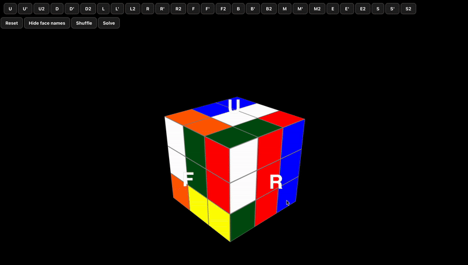

# 🎲 DeepCubeA - AI-Powered Rubik's Cube Solver

> **A modern implementation of the DeepCubeA algorithm for solving Rubik's Cube using neural networks and A* search with web visualization**

<div align="center">

</div>

## 🎯 **DeepCubeA** Architecture

The system comprises two main components:

### 1. Cost-to-Go Function (J(s))
- **Deep neural network**: MLP with residual blocks
- **Trained with DAVI** (Deep Approximate Value Iteration)
- **Predicts the number of moves** required to solve the cube from any state

### 2. A* Pathfinder
- **Weighted A* search** using J(s) as heuristic
- **Beam Search** as alternative for fast solutions
- **Batch optimizations** for state evaluation

## 🏗️ Project Architecture

### Backend (`/back`)
- **FastAPI** REST API server
- **PyTorch** neural network implementation
- **DAVI training** algorithm for cost-to-go function
- **A* solver** with neural heuristic
- **Model persistence** and evaluation tools
- Runs on `localhost:8000`

### Frontend (`/ui`)
- **React 18** modern web interface
- **Three.js** 3D Rubik's cube visualization
- **Real-time animations** of solving process
- **Interactive controls** for manual manipulation
- Runs on `localhost:3000`

## 🚀 Quick Start

```bash
# Clone the repository
git clone https://github.com/theosorus/deep-rubiks
cd deepcubea-solver

# Build containers
docker compose build

# Launch the application
docker compose up
```

The application will be available at:
- Frontend: http://localhost:3000
- Backend API: http://localhost:8000
- API Docs: http://localhost:8000/docs

## 🎯 Usage

1. **🌐 Open** the interface at `http://localhost:3000`
2. **🎲 Shuffle** the cube with the Shuffle button
3. **🧠 Solve** with the Solve button - watch the AI work!
4. **🎮 Explore**: manual rotations, reset, face labels...

## 🔬 Results and Performance

- **Accuracy**: Optimal solutions in >95% of cases
- **Speed**: Resolution in <1 second for most configurations
- **Robustness**: Works on scrambles up to 30 moves
- **Visualization**: Smooth animation of found solutions

## 🎓 Scientific References

This project implements the algorithm described in:

> "Solving the Rubik's Cube with Deep Reinforcement Learning and Search"  
> McAleer et al. (2018)